# TribeTrip Preview Gallery

Screenshots showcasing TribeTrip's features and user interface.

---

## Landing Page

The welcoming homepage introduces TribeTrip's value proposition and guides visitors to register or sign in.

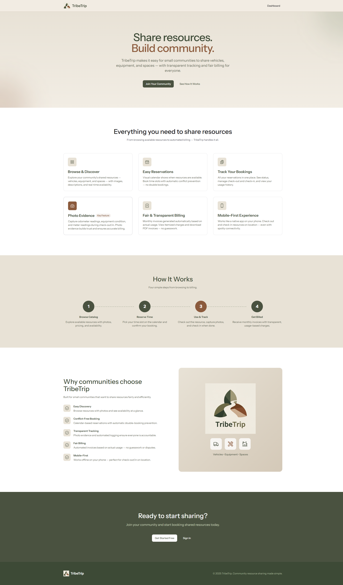

---

## Authentication

### Registration
New members can register and await admin approval, or use an invitation link for instant access.

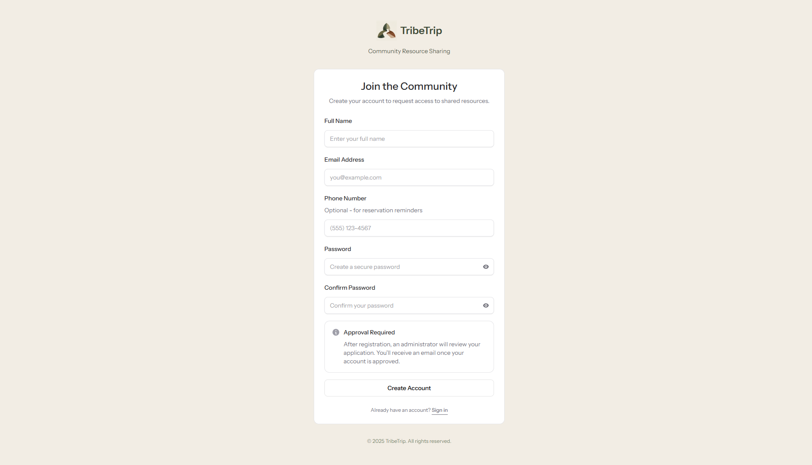

### Login
Clean, simple login for returning members.

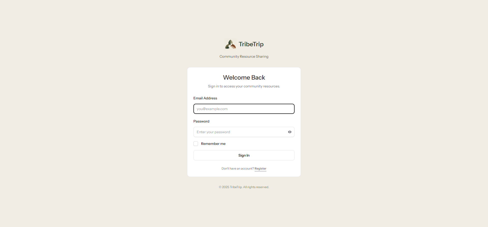

---

## Member Experience

### Dashboard
After logging in, members see a personalized dashboard with quick links to resources and reservations.

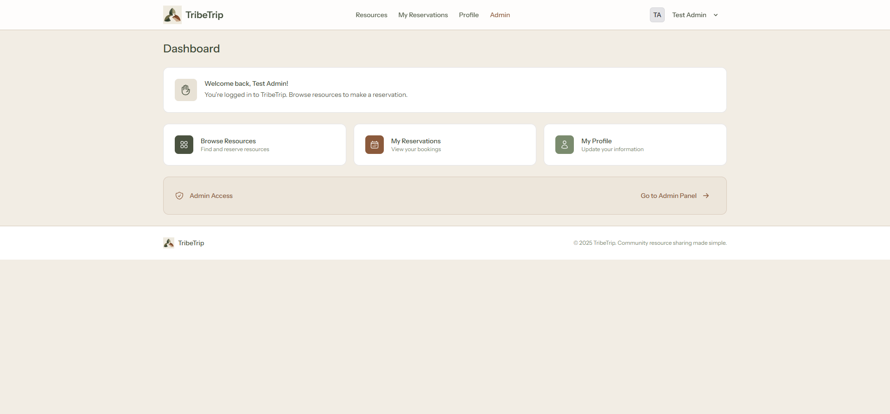

### Resource Catalog
Browse all available community resources with photos, pricing, and availability status.

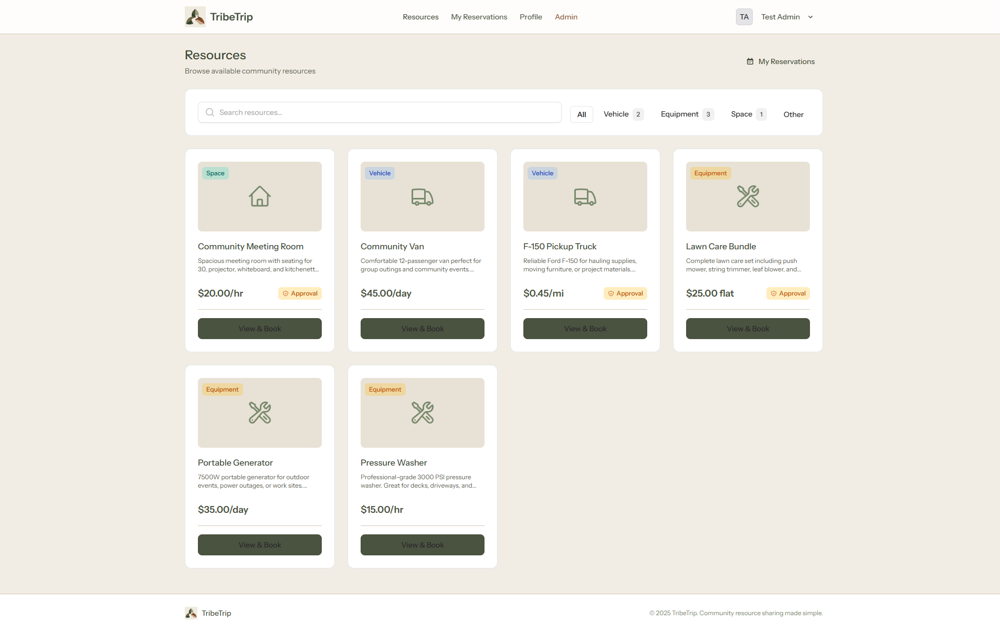

### Resource Detail & Booking
View detailed resource information and book available time slots via the interactive calendar.

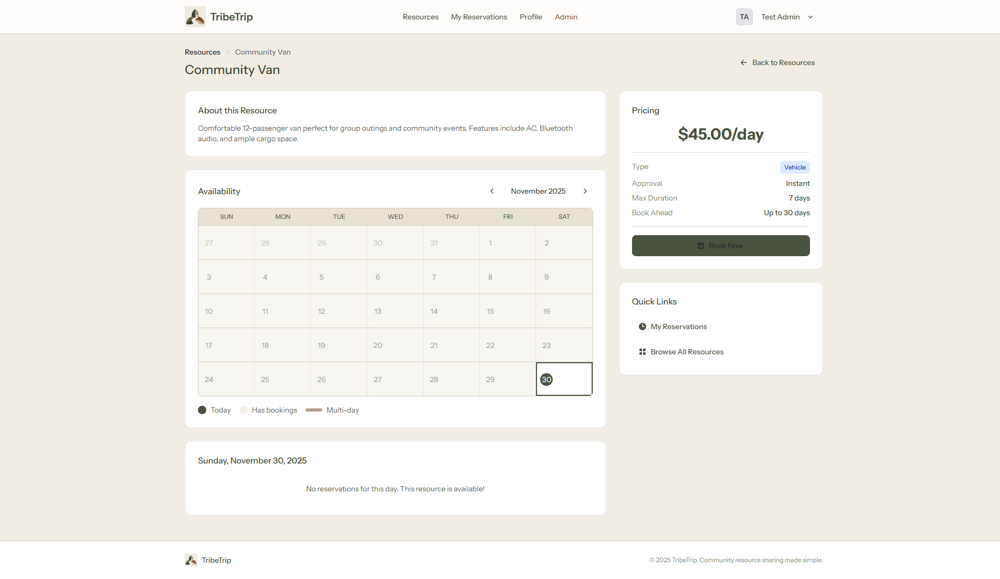

### My Reservations
Track all your bookings — upcoming, in-progress, and completed.

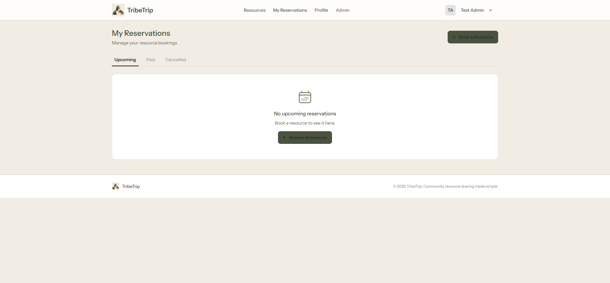

### My Invoices
View monthly invoices with itemized charges and download PDF receipts.

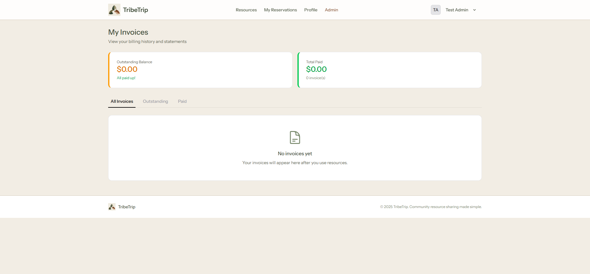

---

## Admin Dashboard

### Approval Queue
Review and approve new member registration requests.

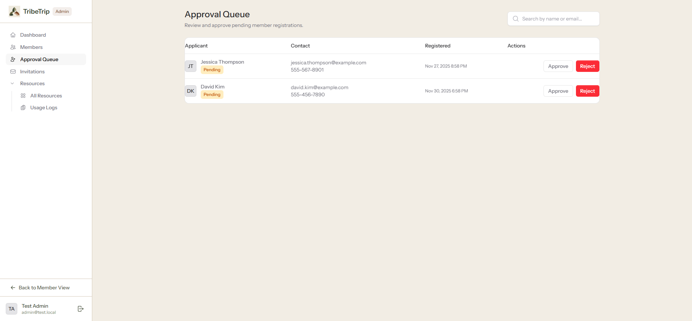

### Member Management
View all members, their status, and usage activity.

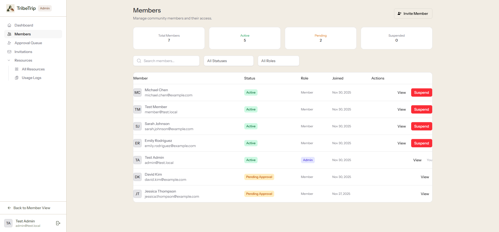

### Resource Management
Add, edit, and manage community resources with images and pricing.

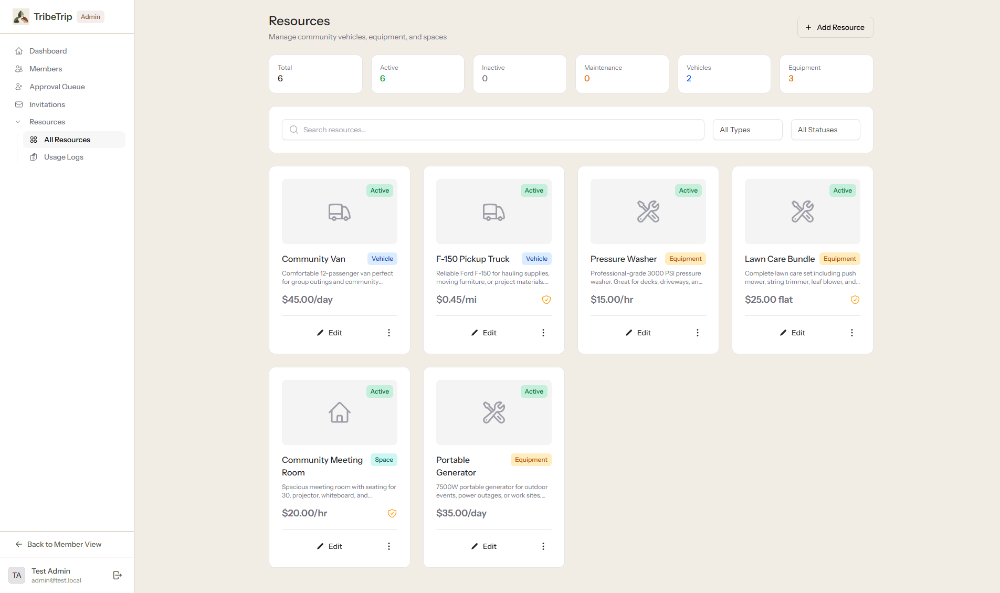

### Usage Logs
Review and verify member-submitted usage logs.

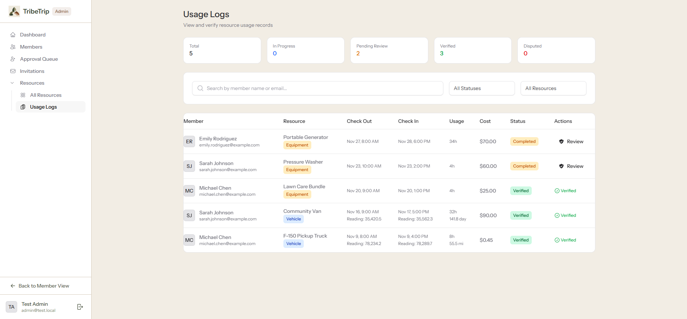

### Invitation System
Send email invitations for pre-approved member registration.

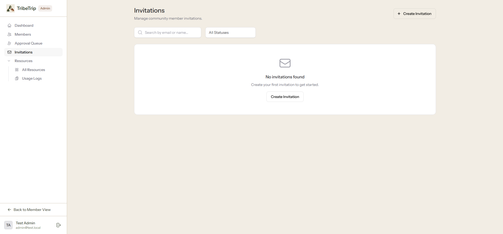

---

> **Note:** Screenshots are captured from the demo environment with sample data. Your community's instance will display your own resources and branding.

---

## Additional Features (Screenshots Coming Soon)

- **Check-Out/Check-In Flow** — Photo capture for odometer readings and equipment condition
- **Mobile Experience** — Responsive PWA design optimized for phones
- **Dark Mode** — Full dark theme support across all screens
